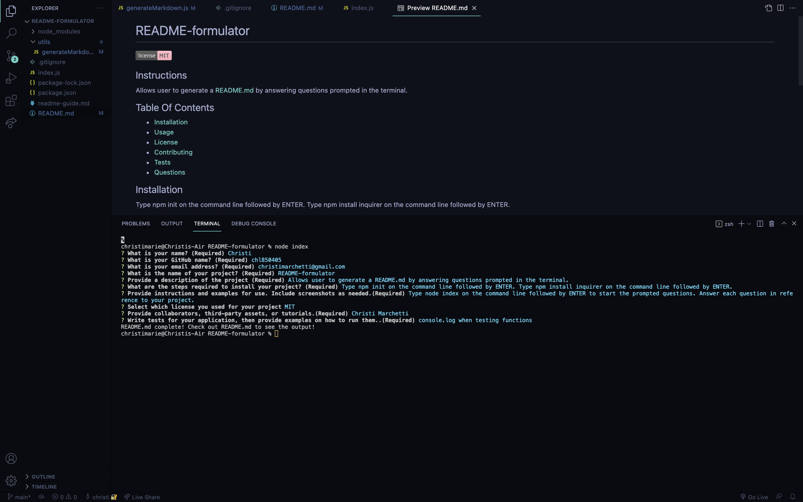
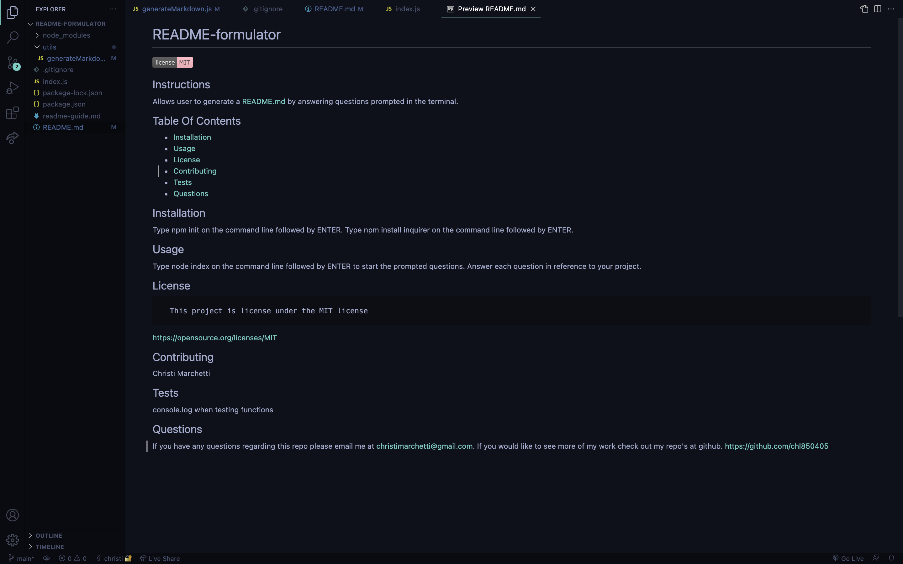

# README-formulator
   
  
  ## Instructions
  Allows user to generate a README.md by answering questions prompted in the terminal.

  ## Table Of Contents
  - [Installation](#intasllation)
  - [Usage](#usage)
  - [License](#license)
  - [Contributing](#contributing)
  - [Tests](#tests)
  - [Questions](#questions)

  ## Installation
  Type npm init on the command line followed by ENTER. Type npm install inquirer on the command line followed by ENTER.

  ## Usage
  Type node index on the command line followed by ENTER to start the prompted questions. Answer each question in reference to your project.

  https://youtu.be/dIQ4UGHoxXc

  

  

  ## License
  
      This project is license under the MIT license
      

  https://opensource.org/licenses/MIT

  ## Contributing
  Christi Marchetti

  ## Tests
  console.log when testing functions

  ## Questions
  
  If you have any questions regarding this repo please email me at christimarchetti@gmail.com. If you would like to see more of my work check out my repo's at github. https://github.com/chl850405

